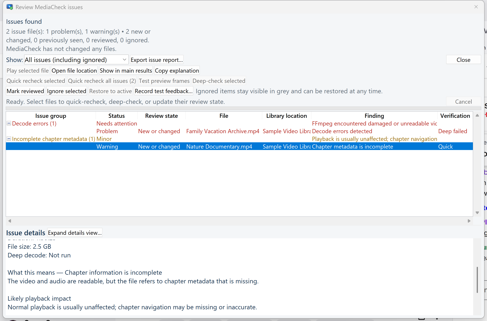

# MediaCheck

MediaCheck is a read-only Windows utility for checking large video libraries for unreadable files, damaged video data, warnings, and possible duplicates.

It scans ordinary media folders with FFprobe and FFmpeg, so it can be used alongside Plex, Jellyfin, Emby, or a library that is not connected to a media server.

> MediaCheck never renames, moves, repairs, or deletes your media files.

## See what a result means

This privacy-safe demonstration uses sample filenames. MediaCheck separates the technical evidence from a plain-language explanation, likely playback impact, and conservative next steps.

## Download the beta

[Download MediaCheck 0.15.1 Beta](../../releases/tag/v0.15.1-beta)

The current public beta supports 64-bit Windows 11. The installer is not digitally signed yet, so Windows SmartScreen may identify it as an unrecognized application. Every release includes a SHA-256 checksum so the installer can be verified after download.

## Highlights

- Quick FFprobe health checks and optional full video decoding
- Multiple library locations across local, removable, and network storage
- Fast refreshes that reuse unchanged scan results
- Healthy, Warning, and Problem classifications
- Plain-language explanations and focused rechecks
- Approximate decode-error positions and structured playback feedback
- Expandable, resizable issue details
- Persistent Reviewed and Ignored issue states
- Scan history and change reports
- Duplicate candidates, full byte verification, and preview-frame comparison
- Privacy-conscious diagnostic and support-bundle export

## Requirements

- Windows 11, 64-bit
- FFprobe and FFmpeg
- Read access to the folders being scanned

MediaCheck includes a guided setup that explains how to select `ffprobe.exe` from an FFmpeg download and remembers the location afterward.

## Privacy and safety

MediaCheck runs locally. It does not upload scan results, filenames, library paths, preview images, or media files. Support bundles exclude media, previews, scan-cache contents, scan-history contents, and configured library paths.

MediaCheck is beta software. Keep normal backups and never use a scan result as the sole reason to delete a file.

## Feedback and bug reports

Use [GitHub Issues](../../issues) to report confusing results, possible false positives, performance problems, display issues, or crashes. Please review [SUPPORT.md](SUPPORT.md) before attaching a diagnostic bundle.

## Development disclosure

MediaCheck was built through an iterative process with substantial AI coding assistance under human direction and hands-on Windows testing. Version 0.15.1 includes 79 automated tests.

## Source availability

This repository distributes MediaCheck documentation and release packages. The application source code is not currently published.
